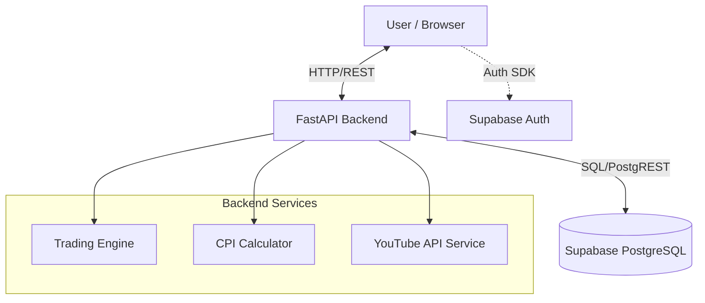

# ALL-IN-ONE Technical Guide: Nombre MVP

This document serves as a comprehensive technical overview of the Nombre project. It covers the technology stack, system architecture, and the core mathematical mechanics that drive the platform.

---

## 1. Technology Stack

### Frontend (Client-Side)
Building a high-performance, interactive dashboard.

*   **Language**: TypeScript (React)
    *   Ensures type safety and better developer experience.
*   **Framework**: [Vite](https://vitejs.dev/) + React
    *   Fast build tool and dev server.
*   **Styling**: [Tailwind CSS](https://tailwindcss.com/)
    *   Utility-first CSS for rapid UI development.
*   **State Management**: [Zustand](https://github.com/pmndrs/zustand)
    *   Lightweight global state management (replaces Redux/Context).
*   **Charts**: [Lightweight Charts](https://tradingview.github.io/lightweight-charts/) (TradingView)
    *   High-performance financial charts (Candlestick, Area).
*   **Animations**: [Framer Motion](https://www.framer.com/motion/)
    *   Smooth UI transitions and layout animations.
*   **HTTP Client**: Native `fetch` wrapper (`ApiClient` class).

### Backend (Server-Side)
Handling business logic, trading calculations, and data processing.

*   **Language**: Python 3.11+
    *   Great for mathematical calculations (financial logic) and data processing.
*   **Framework**: [FastAPI](https://fastapi.tiangolo.com/)
    *   High-performance, async Python web framework.
    *   Automatic API documentation (Swagger/OpenAPI).
*   **Server**: Uvicorn
    *   ASGI server for running the FastAPI application.
*   **Data Models**: Pydantic
    *   Data validation and settings management.

### Database & Infrastructure
Persistent storage and authentication.

*   **Database**: [Supabase](https://supabase.com/) (PostgreSQL)
    *   Relational database for users, transactions, and pools.
*   **Authentication**: Supabase Auth
    *   Handles user sessions and security.
*   **Integration**: `supabase-py` (Python client) and `@supabase/supabase-js` (JS client).

---

## 2. System Architecture (Deep Dive)

The application follows a standard **Client-Server** architecture with a centralized database.

### Request Lifecycle
1.  **Request**: Frontend sends a POST request (e.g., `/api/v1/trade/execute`).
    *   Includes `Authorization: Bearer <token>` header.
2.  **Middleware / Dependency**: `get_current_user` validates the JWT token with Supabase Auth.
3.  **Router**: `routers/trading.py` receives the validated request.
4.  **Service Layer**:
    *   **Trading Engine**: Calculates the math (see below).
    *   **Slippage Check**: Verifies the price hasn't moved too much.
5.  **Database Transaction**:
    *   Updates `users` check balance.
    *   Updates `pools` (reserve, price, volume).
    *   Updates `user_holdings` (avg buy price, amount).
    *   Inserts `transactions` (record of event).
    *   Inserts `price_history` (for charts).
6.  **Response**: Returns the trade details to the frontend.

### Database Schema Relationships
*   **Users** have many **Transactions** and **Holdings**.
*   **Creators** have one **Pool**.
*   **Pools** track the state (`nmbr_reserve`, `token_supply`, `current_price`).
*   **Transactions** link a **User** and a **Pool** for a specific event.

---

## 3. Core Mechanics: AMM & Bonding Curve (Deep Dive)

Nombre uses an **Automated Market Maker (AMM)** model, specifically a **Constant Product Bonding Curve**. This is the same logic used by Uniswap (v2).

### The Math: $x \cdot y = k$

*   **x**: Amount of **$NMBR** (Cash) in the liquidity pool.
*   **y**: Amount of **Creator Tokens** in the liquidity pool.
*   **k**: The Constant Product (Invariant). This number **never changes** during a trade.

**Liquidity Constants**:
*   **Token Supply**: Fixed at **100,000,000 (100M)** tokens per creator.
*   **Base Liquidity**: All pools start with at least **100,000 $NMBR** in value (see CPI section).

### Buying Tokens (Price Increases)
1.  User inputs **$\Delta x$** (NMBR amount).
2.  Fee is deducted (1%): $\Delta x_{net} = \Delta x \cdot 0.99$.
3.  New Reserve: $x_{new} = x + \Delta x_{net}$.
4.  New Token Supply: $y_{new} = k / x_{new}$.
5.  Tokens Out: $\Delta y = y - y_{new}$.
6.  **Price Impact**: The pool now has more $NMBR and fewer tokens, so the price ($x/y$) increases.

### Selling Tokens (Price Decreases)
1.  User inputs **$\Delta y$** (Token amount).
2.  New Token Supply: $y_{new} = y + \Delta y$.
3.  New Reserve: $x_{new} = k / y_{new}$.
4.  NMBR Out (Gross): $\Delta x = x - x_{new}$.
5.  Fee is deducted (1%) from output: $\Delta x_{net} = \Delta x \cdot 0.99$.
6.  **Price Impact**: The pool now has more tokens and less $NMBR, so the price decreases.

### Slippage Protection
*   **Definition**: The difference between the *expected price* (when you view the screen) and the *actual price* (when the trade executes).
*   **Mechanism**: The API accepts a `max_slippage_pct` (default 5%). If the executed price differs by more than this % (due to other users trading instantly before you), the trade **fails** and reverts.

---

## 4. CPI: Creator Performance Index (Deep Dive)

The CPI is the engine that determines the **Initial Valuation** of a creator. It is calculated when a creator is first added to the platform.

### The Formula (v3 - "Deep Liquidity")
The system uses a linear formula to ensure all pools have deep enough liquidity to support trading without massive volatility.

$$CPI = 100,000 + \frac{Subscribers}{100} + \frac{LifetimeViews}{100,000}$$

*   **Base Floor**: **100,000**. Every creator starts with at least this base score.
*   **Subscriber Weight**: 1 point per 100 subscribers.
*   **View Weight**: 1 point per 100,000 lifetime views.

### From CPI to Market Cap
In this version of the logic:
$$\text{Initial Market Cap (\$NMBR)} = \text{CPI Score}$$

Example for a creator with **1M Subscribers** and **100M Views**:
1.  Base: 100,000
2.  Subs: $1,000,000 / 100 = 10,000$
3.  Views: $100,000,000 / 100,000 = 1,000$
4.  **Total CPI / Market Cap**: **111,000 $NMBR**.

### From Market Cap to Price
$$\text{Initial Price} = \frac{\text{Market Cap}}{\text{Total Supply}}$$

*   **Total Supply**: 100,000,000 (Fixed).
*   **Price**: $111,000 / 100,000,000 = \textbf{0.00111 \$NMBR}$.

---

## 5. Folder Structure

### `src/` (Frontend)
*   `components/`: Reusable UI elements (Charts, Buttons, Cards).
*   `pages/`: Full screen layouts (Landing, Trade, Profile).
*   `services/`: API communication (`api.ts`).
*   `stores/`: Global state (User session, Theme).
*   `hooks/`: Custom React hooks (realtime updates, resizing).

### `backend/` (Backend)
*   `app/routers/`: API endpoints.
    *   `trading.py`: Buy/Sell logic.
    *   `creators.py`: Creator management & Youtube fetch.
*   `app/services/`: Business logic.
    *   `trading_engine.py`: The AMM math class.
    *   `youtube_service.py`: YouTube API integration & CPI logic.
*   `app/models/`: Database schemas (Pydantic).

---

